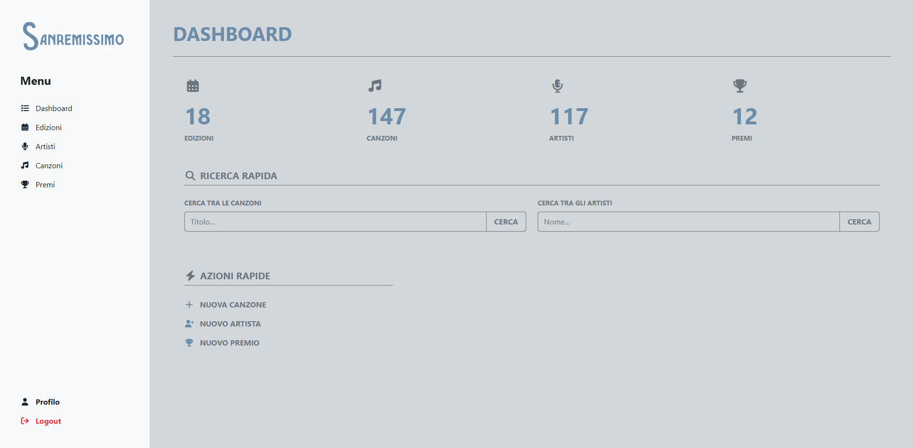
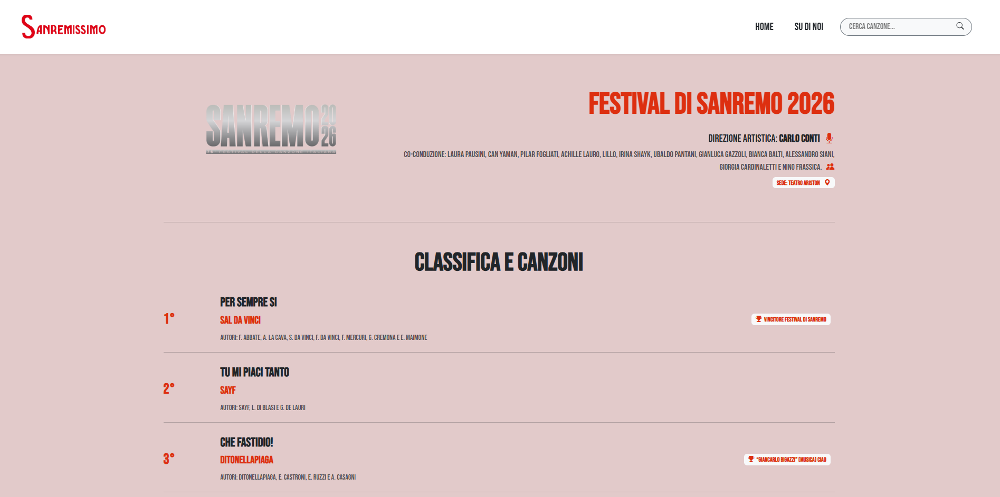
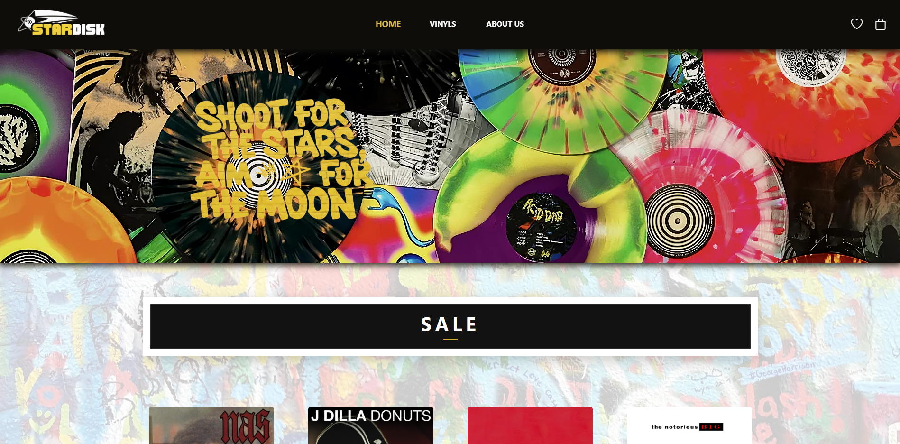

# Ciao, sono Gabriele! 👋

### Sviluppatore Full Stack

Mi occupo di progettare architetture efficienti, curando ogni aspetto del dato, dalla struttura del database fino all'interfaccia utente.

---

### 🛠️ Tech Stack

       

---

### 🏆 Progetti in Evidenza

#### 🎤 Sanremissimo: [Back-end](https://github.com/gabrieletodaroo9/sanremo-laravel-final-project) | [Front-end](https://github.com/gabrieletodaroo9/sanremo-react-final-project)
*Architettura Full Stack*
- **Back-office (Laravel):** Gestione centralizzata dei dati e pannello amministrativo.
- **Front-office (React):** Interfaccia utente dinamica che consuma le **REST API**.

  
  

---

#### 🌌 [StarDisk](https://github.com/gabrieletodaroo9/stardisk-sito-web)
*Team Project*
- **Il mio ruolo:** Sviluppo del comparto **Frontend** e progettazione del **carrello**.
- **Stack:** Utilizzo di **React** per la creazione di pagine performanti.
- **Learning:** Gestione del flusso di lavoro in team e integrazione tra micro-servizi.

---

### 📫 Contatti
